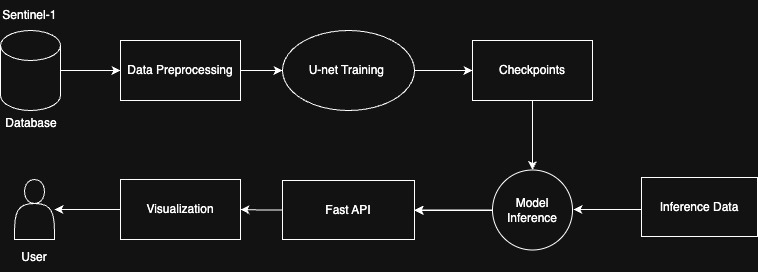

# ZINova — Detect Oil Spill, Analyze, Clean.

ZINova is an **AI-powered oil spill monitoring and analysis platform** that integrates:
- **Deep learning–based oil spill detection** from satellite imagery
- **Interactive geospatial visualization** on a live map
- **LLM-powered assistant** for spill analysis, risk assessment, and response guidance  

---

## System Overview

The platform consists of three integrated layers:

**1. AI Detection Layer**
- UNet-based oil spill segmentation
- Supports both:
  - **PNG images** (rapid prototyping)
  - **GeoTIFF Sentinel-1 SAR images** (deployment-grade)
- Produces **binary oil spill masks**

**2. Geospatial Visualization Layer**
- Interactive **Streamlit + Folium** web map
- Caspian Sea danger zones
- Spill overlays and zone-based visualization
- Simulated cleanup status monitoring

**3. AI Assistant Layer**
- LLM-based contextual assistant
- Uses:
  - Current spill properties
  - Zone metadata
  - Historical spill patterns
- Provides:
  - Risk assessment
  - Trend interpretation
  - Recommended response actions

---

## AI Model Training
We utilized data from the [**Refined Deep-SAR Oil Spill (SOS) dataset**](https://zenodo.org/records/15298010)  

and the [**Sentinel-1 SAR Oil Spill Image Dataset**](https://zenodo.org/records/8346860).

### PNG-Based Training
Notebook: `oil_spill_detection_png.ipynb`

- Input: Grayscale PNG satellite images
- Target: Binary PNG masks
- Model: UNet with ResNet-34 encoder
- Input channels: 1
- Loss: BCEWithLogitsLoss
- Metrics: Dice Score, IoU
- Used for **fast experimentation and prototyping**

**Dataset (Google Drive):**  
https://drive.google.com/drive/folders/1UZIo3COaprxhT2i4dcPr1Vbz7eftifUo?usp=sharing 

---

### GeoTIFF / Sentinel-1 SAR Training
Notebook: `oil_spill_detection_tiff.ipynb`

- Input: Dual-band Sentinel-1 SAR GeoTIFF images
- Target: Binary GeoTIFF masks
- Input channels: 2 (dual polarization)
- Per-band min–max normalization
- GeoTIFF metadata preserved for GIS compatibility
- Used for **deployment-grade oil spill detection**

**Dataset (Google Drive):**  
https://drive.google.com/drive/folders/11jUfpt6w3GDFtg0bxn6_gdCsTJFWBDIa?usp=sharing

---
### Model Weights
Model weights for the trained models (20 and 50 epochs) can be accessed here:  
[Download Model Weights](https://drive.google.com/drive/folders/1Da_xFOXH4RjJJ3k08WRFdE3pgLkZcKF_?usp=drive_link)

---
### Initial Results
- PNG Notebook (16 epochs):
Train | Loss: 0.1704  Dice: 0.7844  IoU: 0.6783
Val   | Loss: 0.1606 Dice: 0.8120 IoU: 0.7117
- TIFF Notebook (50 epochs):
Train | Loss: 0.2077  Dice: 0.4676  IoU: 0.3694
Val   | Loss: 0.2444  Dice: 0.4859  IoU: 0.3562

## Web Application Features

- **Interactive Satellite Map**
  - Caspian Sea focus
  - Clickable danger zones
  - Dynamic zoom and overlays

- **Spill Information Panel**
  - Spill ID, area, thickness
  - Detection confidence
  - Cleanup status simulation

- **Cleanup Control Simulation**
  - Status flow: Idle → Cleaning → Done
  - Real-time interface updates

- **AI Assistant**
  - Natural language question answering
  - Historical pattern analysis
  - Risk level estimation (Low / Medium / High)
  - Action-oriented recommendations

---

## Environment Setup

### 1. Install Dependencies
```bash
pip install -r requirements.txt
```

### 2. Configure API Key
Create a .env file in the project root:
```bash
OPENAI_API_KEY=your_api_key_here
```

## Running the Application
```bash
streamlit run app.py
```

The application will be available at:
```bash
http://localhost:8501
```
### Overall Architecture 



### Contributors
This project was implemented by Ilhama Novruzova, Zahra Bayramli and Nilufar Aliyeva.

